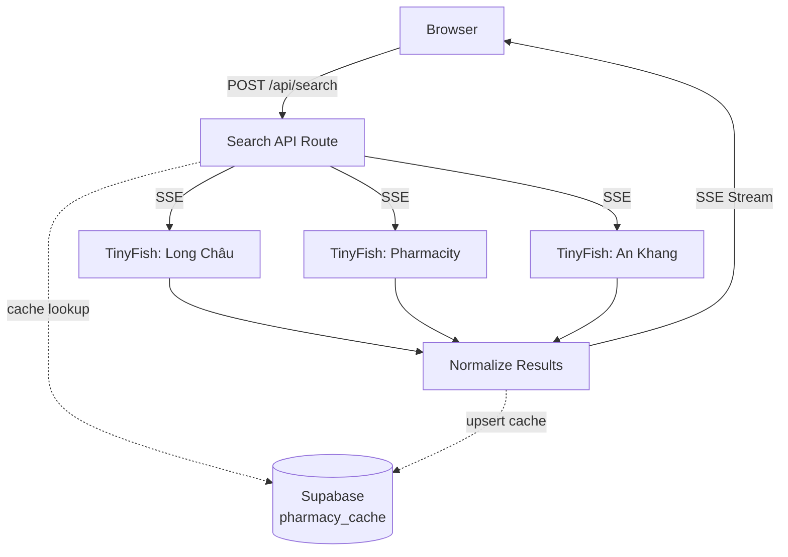

# Pharmacy Panic

> Real-time medicine price comparison across Vietnam's major pharmacy chains — powered by [TinyFish](https://tinyfish.ai/) parallel browser agents.

**Live demo → [pharmacy-panic.vercel.app](https://pharmacy-panic.vercel.app)**

---

## What it does

Vietnamese pharmacies don't publish prices online. You have to visit Long Châu, Pharmacity, and An Khang separately, each with different layouts and product names. This app sends TinyFish browser agents to all three **simultaneously**, extracts structured pricing data, and streams results back in real time.

- Search any medicine or health product across **3 major chains**
- See **live prices** from Long Châu, Pharmacity, and An Khang side-by-side
- **Quick category buttons** for common searches (pain relief, cold medicine, vitamins, etc.)
- Results stream in as each pharmacy completes — no waiting for the slowest one
- Optional **6-hour result caching** via Supabase (app works fine without it)

---

## Demo


---

## How it works

```
User enters medicine name
        │
        ▼
POST /api/search
        │
        ├── Cache hit? → stream result instantly via SSE
        │
         └── Cache miss? → fire TinyFish SSE requests for all 3 pharmacies in parallel
                               │
                               ├── TinyFish: Long Châu
                               ├── TinyFish: Pharmacity
                               └── TinyFish: An Khang
                                   │
                                   ├── Parse results
                                   ├── Normalize prices (VND)
                                   └── Stream to client via SSE
```

Each pharmacy search is handled by a separate TinyFish agent. The agents handle cookie banners, dynamic loading, and pagination. The API route streams results via **Server-Sent Events** so the UI updates as pharmacies finish — typically within 10–20 seconds for a full search.

---

## TinyFish API snippet

Here's how the app calls TinyFish for each pharmacy:

```typescript
const response = await fetch(TINYFISH_SSE_URL, {
  method: "POST",
  headers: {
    "Content-Type": "application/json",
    Authorization: `Bearer ${process.env.TINYFISH_API_KEY}`,
  },
  body: JSON.stringify({
    url: searchUrl,
    goal: `You are extracting medicine/health product data from a Vietnamese pharmacy search results page.

Steps:
1. Wait for the page content to fully render. Many Vietnamese pharmacy sites are SPAs (React/Vue) or use lazy-loading — wait until product listing cards are visible in the DOM before extracting. Allow up to 10 seconds for JavaScript rendering.
2. Dismiss any cookie consent banners, popup overlays, newsletter modals, or "Tải app" (download app) prompts by clicking their close/dismiss buttons.
...`,
    output_schema: {
      type: "object",
      properties: {
        pharmacy: { type: "string" },
        products: {
          type: "array",
          items: {
            type: "object",
            properties: {
              name: { type: "string" },
              price: { type: "number" },
              unit: { type: "string" },
            },
          },
        },
      },
    },
  }),
});
```

The response streams back as Server-Sent Events, with each pharmacy's results arriving as they complete.

---

## Running locally

```bash
git clone https://github.com/tinyfish-io/tinyfish-cookbook
cd tinyfish-cookbook/pharmacy-panic
npm install
```

Create a `.env.local` file:

```env
TINYFISH_API_KEY=your_key_here

# Optional — for result caching (app works fine without it)
NEXT_PUBLIC_SUPABASE_URL=your_supabase_url
SUPABASE_SERVICE_ROLE_KEY=your_service_role_key
```

Get a TinyFish API key at [tinyfish.ai](https://tinyfish.ai/).

```bash
npm run dev
```

Open [http://localhost:3000](http://localhost:3000).

---

## Architecture diagram



---

## Tech stack

| Layer | Choice | Why |
|---|---|---|
| Framework | Next.js 16 (App Router) | SSE streaming via Node.js runtime |
| UI | React 19 + Tailwind CSS 4 + shadcn/ui | Fast, clean, no design system overhead |
| Scraping | [TinyFish API](https://tinyfish.ai/) | Parallel browser agents, structured JSON output |
| Validation | Zod | Type-safe schema validation for pharmacy results |
| Caching | Supabase (Postgres) | 6-hour TTL, graceful degradation if unavailable |
| Hosting | Vercel | Zero-config, auto-deploys |

---

Built as a take-home demo for [TinyFish](https://tinyfish.ai) — showing what's possible when you give TinyFish a list of niche local websites and let it run in parallel.
